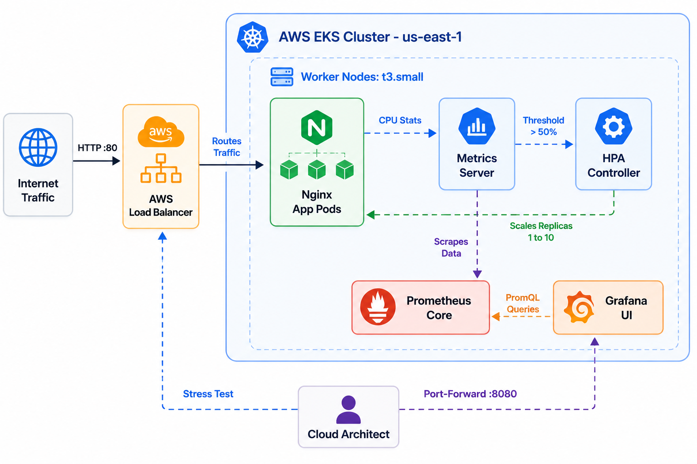
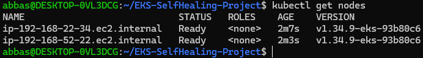
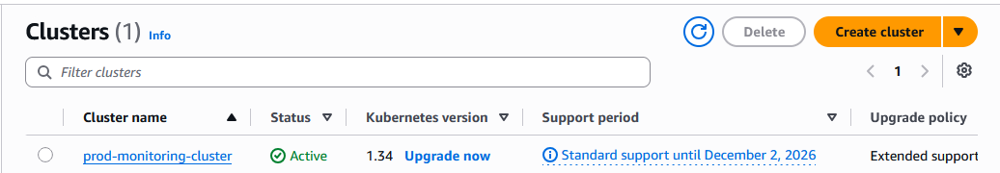
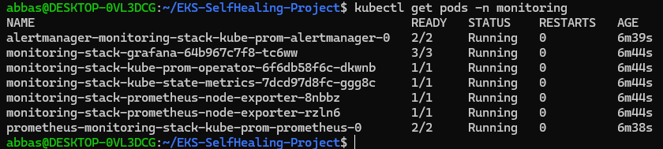
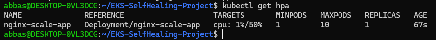
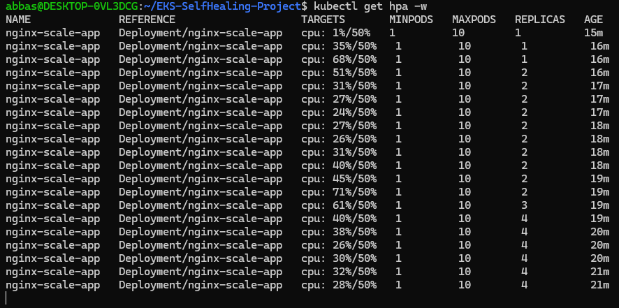
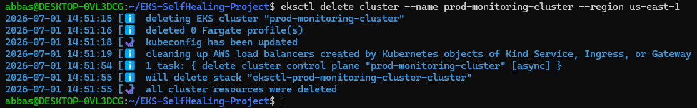

<div align="center">

# 🛡️ AWS EKS Self-Healing & Monitored Cluster


<br>
</div>

## 📖 Project Overview
This project demonstrates the design, deployment, and management of a production-grade, highly available Kubernetes cluster on Amazon Web Services (AWS EKS). The architecture incorporates Infrastructure as Code (IaC) principles, comprehensive observability, and dynamic autoscaling capabilities. The core objective is to showcase a "Self-Healing" system that automatically detects traffic spikes and seamlessly scales workloads (Pods) to maintain optimal performance without any manual intervention, ensuring both reliability and cost-efficiency.

---

## 🧰 Table of Tools

| Category | Tool / Technology | Purpose |
| :--- | :--- | :--- |
| **Cloud Provider** | AWS (Amazon Web Services) | Global infrastructure and compute resources hosting the EKS cluster. |
| **IaC & Provisioning** | `eksctl` | Declarative cluster creation and EC2 node group management. |
| **Container Orchestration** | Kubernetes (EKS) | Managing, scaling, and deploying containerized microservices. |
| **Package Manager** | Helm | Efficiently deploying complex observability stacks. |
| **Observability** | Prometheus & Grafana | Gathering metrics and visualizing cluster health and CPU usage. |
| **Autoscaling** | HPA (Horizontal Pod Autoscaler) | Automatically scaling application pods based on real-time CPU metrics. |

---

## 📂 Repository Structure
```text
EKS-SelfHealing-Project/
├── eks-cluster.yaml      # IaC declarative file for EKS cluster provisioning
├── nginx-app.yaml        # Deployment, Service, and Resource allocations for the app
├── README.md             # Detailed project documentation (This file)
└── images/               # Execution and verification screenshots
    ├── 1-node-ready.png
    ├── 2-aws-console.png
    ├── 3-monitoring.png
    ├── 4-hpa-init.png
    ├── 5-stress-test.png
    ├── 6-cleanup.png
    └── project-diagram.png

```

## 🏛️ System Architecture

<p align="center">
  
  <br>
  <em><b>Figure 1:</b> System Architecture Diagram </em>
</p>


## 🚀 Getting Started: Full Execution Steps 

### Step 1: Environment Setup
Prepared the local administrative environment (WSL/Ubuntu) with the required CLI tools to interact with AWS and Kubernetes.
* Installed `aws-cli`, `kubectl`, `eksctl`, and `helm`.
* Linked the local environment to AWS IAM credentials using `aws configure`.

### Step 2: Infrastructure Provisioning
Created the declarative configuration file (`eks-cluster.yaml`) to define the VPC, region, and node groups. Executed the build command to provision the infrastructure via AWS CloudFormation.
```bash
eksctl create cluster -f eks-cluster.yaml
```
**Verification:**
<p align="center">
  
  <br>
  <em><b>Figure 2:</b> Worker nodes successfully joined the cluster and reached the 'Ready' state.</em>
</p>

<p align="center">
  
  <br>
  <em><b>Figure 3:</b> EKS Cluster actively running in the AWS Management Console.</em>
</p>

### Step 3: Observability Stack Deployment
Utilized Helm to deploy the complete `kube-prometheus-stack` into a dedicated monitoring namespace, enabling full visibility into cluster metrics.
```bash
helm repo add prometheus-community [https://prometheus-community.github.io/helm-charts](https://prometheus-community.github.io/helm-charts)
helm install monitoring-stack prometheus-community/kube-prometheus-stack -n monitoring --create-namespace
```
**Verification:**
<p align="center">
  
  <br>
  <em><b>Figure 4:</b> Prometheus and Grafana pods running securely in the monitoring namespace.</em>
</p>

### Step 4: Application Deployment & HPA Configuration
Deployed an Nginx workload with strict CPU limits and requests (`10m`), exposing it via a LoadBalancer. Configured the Horizontal Pod Autoscaler (HPA) to scale out the pods if CPU utilization exceeds 50%.
```bash
kubectl apply -f nginx-app.yaml
kubectl autoscale deployment nginx-scale-app --cpu-percent=50 --min=1 --max=10
```
**Verification:**
<p align="center">
  
  <br>
  <em><b>Figure 5:</b> HPA successfully attached to the deployment, monitoring current vs. target CPU utilization.</em>
</p>

### Step 5: Stress Testing (The Self-Healing Validation)
Generated massive simulated HTTP traffic using a busybox container in an infinite loop to spike the CPU and trigger the autoscaling mechanism.
```bash
kubectl run -i --tty load-generator --rm --image=busybox:1.28 --restart=Never -- /bin/sh -c "while true; do wget -q -O- http://nginx-service; done"
```
**Verification:**
<p align="center">
  
  <br>
  <em><b>Figure 6:</b> HPA detecting CPU spikes (exceeding 70%) and successfully scaling replicas to stabilize the workload.</em>
</p>

### Step 6: Resource Cleanup
To prevent ongoing cloud costs and adhere to FinOps best practices, the entire infrastructure was programmatically destroyed immediately after the test.
```bash
eksctl delete cluster --region=us-east-1 --name=prod-monitoring-cluster
```
**Verification:**
<p align="center">
  
  <br>
  <em><b>Figure 7:</b> Complete removal of all AWS resources, EC2 instances, and CloudFormation stacks.</em>
</p>

## 🎯 Conclusion & Key Takeaways
1.  **Automation & IaC:** Leveraging tools like `eksctl` and `Helm` transforms complex, multi-day infrastructure setups into rapid, repeatable automated deployments.
2.  **Proactive Reliability:** Integrating HPA ensures that applications remain highly available during unexpected traffic surges. The cluster successfully demonstrated "Self-Healing" by scaling out under pressure and scaling in when the traffic subsided.
3.  **Cost Optimization (FinOps):** Successfully deploying, testing, and tearing down the environment using ephemeral architecture principles demonstrates a strong understanding of cloud cost management and resource efficiency.

---

## ⚠️ Challenges Encountered & Solutions
* **Challenge:** Encountered `exceeded max wait time` during cluster creation due to AWS vCPU quotas.
  * **Solution:** Optimized the NodeGroup by switching from `t3.medium` to `t3.small` and verified AWS Service Quotas to ensure resource availability.
* **Challenge:** Pods were unevictable during cluster teardown, preventing automatic cleanup.
  * **Solution:** Investigated the node's running pods and used the `--disable-eviction` flag with `eksctl` to force a clean shutdown and ensure cost-effective resource deletion.

## 🚀 Future Enhancements
* **CI/CD Integration:** Implementing GitHub Actions to automate the deployment process (GitOps).
* **Security Hardening:** Integrating AWS IAM Roles for Service Accounts (IRSA) for fine-grained pod permissions.
* **Cost Management:** Setting up AWS Budget Alerts to monitor spending during development cycles.

## 🤝 Acknowledgments
Special thanks to the open-source communities behind **Kubernetes**, **Prometheus**, and **eksctl** for building the robust ecosystem that makes modern Cloud Infrastructure Engineering possible.

**Architected by:** Ahmed Mohamed Abbas Bahij

[](https://www.linkedin.com/in/ahmedabbas99)

Cloud Infrastructure & DevOps Engineer
